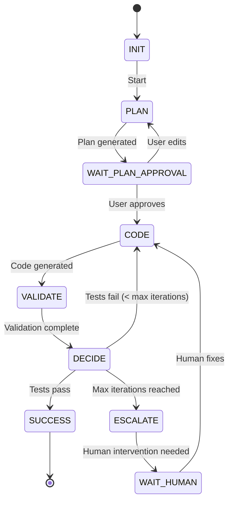

# Ironbees Agent Mode - Architecture Design Document (ADD)

**버전**: v1.0
**작성일**: 2025-11-11
**상태**: Draft
**작성자**: Ironbees Architecture Team

---

## 1. 시스템 개요 (System Overview)

### 1.1 목적 (Purpose)

Ironbees Agent Mode는 .NET 개발자를 위한 자율 코딩 에이전트 시스템입니다. 핵심 목표는:

- **자율성**: Generate-Validate-Refine 루프를 통한 자가 개선
- **정확성**: Roslyn 기반 100% 정확한 코드 컨텍스트
- **신뢰성**: Human-in-the-Loop을 통한 사용자 제어
- **.NET 네이티브**: .NET 생태계의 고유 강점 극대화

### 1.2 핵심 원칙 (Core Principles)

```yaml
Convention-based:
  설명: 복잡한 설정 없이 규약으로 작동
  예시: /agents/{agent-name}/agent.yaml 자동 발견

Thin Wrapper:
  설명: 최소 추상화, 네이티브 도구 직접 활용
  예시: Roslyn API 직접 사용 (래핑 최소화)

.NET Native:
  설명: Python 프레임워크 이식 금지
  예시: Roslyn, MSBuild, dotnet CLI 극대화

Progressive Complexity:
  설명: 단순 → 복잡 단계적 확장
  예시: Phase 1 (단일 파일) → Phase 2 (멀티 파일)

Production Ready:
  설명: 데모가 아닌 실제 사용 가능
  예시: 관찰 가능성, 비용 제어, 에러 복구
```

### 1.3 시스템 경계 (System Boundaries)

**In Scope**:
- C# 코드 생성 및 수정
- .NET 프로젝트 빌드 및 테스트
- Roslyn 기반 코드 분석
- VS Code / Visual Studio 통합
- Git 워크플로우 자동화

**Out of Scope** (Phase 1):
- 다른 언어 지원 (Python, Java 등)
- 클라우드 배포 자동화
- 프로젝트 생성 (기존 프로젝트 수정만)

---

## 2. 고수준 아키텍처 (High-Level Architecture)

### 2.1 시스템 컨텍스트 다이어그램

```
┌─────────────────────────────────────────────────────────┐
│                     External Actors                      │
├─────────────────────────────────────────────────────────┤
│  Developer (VS Code) │ GitHub │ LLM (Claude/GPT)        │
└───────────┬──────────┴────────┴──────────────┬──────────┘
            │                                   │
            │ ◄── User Input / Approval ───►   │
            │                                   │
┌───────────▼───────────────────────────────────▼──────────┐
│              Ironbees Agent Mode System                  │
│                                                           │
│  ┌────────────────────────────────────────────────────┐  │
│  │       Stateful Graph Orchestrator (Core)          │  │
│  │  - Workflow engine                                │  │
│  │  - State management                               │  │
│  │  - Node routing                                   │  │
│  └────────────────┬───────────────────────────────────┘  │
│                   │                                       │
│  ┌────────────────┴───────────────────────────────────┐  │
│  │         Agent Layer (Microsoft.Agents.AI)         │  │
│  │  - PlannerAgent                                   │  │
│  │  - CoderAgent                                     │  │
│  │  - ValidatorAgent                                 │  │
│  │  - DebuggerAgent (Phase 2)                        │  │
│  └────────────────┬───────────────────────────────────┘  │
│                   │                                       │
│  ┌────────────────┴───────────────────────────────────┐  │
│  │         MCP Protocol Layer                        │  │
│  │  - Tool discovery                                 │  │
│  │  - JSON-RPC 2.0                                   │  │
│  │  - stdio transport                                │  │
│  └────────────────┬───────────────────────────────────┘  │
│                   │                                       │
│  ┌────────────────┴───────────────────────────────────┐  │
│  │              Tools (MCP Servers)                  │  │
│  │  - RoslynTool     - FileTool                      │  │
│  │  - MSBuildTool    - GitTool                       │  │
│  │  - DotNetTestTool - LSPTool                       │  │
│  └───────────────────────────────────────────────────┘  │
│                                                           │
└───────────────────────────────────────────────────────────┘
            │                                   │
            ▼                                   ▼
┌───────────────────────┐         ┌─────────────────────────┐
│  .NET Ecosystem       │         │  External Services      │
│  - Roslyn Compiler    │         │  - OpenTelemetry        │
│  - MSBuild            │         │  - LangSmith            │
│  - dotnet CLI         │         │  - GitHub API           │
└───────────────────────┘         └─────────────────────────┘
```

### 2.2 레이어 아키텍처

```
┌─────────────────────────────────────────────────────────┐
│ Layer 1: Presentation / Interface                       │
│  - CLI (ironbees-agent)                                 │
│  - VS Code Extension                                    │
│  - HTTP API (future)                                    │
└─────────────────────────────────────────────────────────┘
                        ▼
┌─────────────────────────────────────────────────────────┐
│ Layer 2: Orchestration                                  │
│  - StatefulGraphOrchestrator                            │
│  - WorkflowEngine                                       │
│  - StateManager                                         │
└─────────────────────────────────────────────────────────┘
                        ▼
┌─────────────────────────────────────────────────────────┐
│ Layer 3: Agent                                          │
│  - Microsoft.Agents.AI integration                      │
│  - Agent definitions (Planner, Coder, Validator, etc.)  │
│  - Thread-based state                                   │
└─────────────────────────────────────────────────────────┘
                        ▼
┌─────────────────────────────────────────────────────────┐
│ Layer 4: Protocol                                       │
│  - MCP Client                                           │
│  - MCP Server framework                                 │
│  - Tool registry                                        │
└─────────────────────────────────────────────────────────┘
                        ▼
┌─────────────────────────────────────────────────────────┐
│ Layer 5: Tools & Integration                            │
│  - RoslynTool (code analysis)                           │
│  - MSBuildTool (compilation)                            │
│  - DotNetTestTool (testing)                             │
│  - FileTool, GitTool, LSPTool                           │
└─────────────────────────────────────────────────────────┘
```

---

## 3. 핵심 컴포넌트 설계

### 3.1 Stateful Graph Orchestrator

#### 3.1.1 책임 (Responsibilities)

- **워크플로우 실행**: 노드 기반 상태 머신 실행
- **상태 관리**: Immutable state 전환
- **루프 제어**: Generate-Validate-Refine 순환
- **HITL 게이트**: 사용자 승인 대기 및 처리

#### 3.1.2 인터페이스 설계

```csharp
namespace Ironbees.AgentMode.Core;

/// <summary>
/// 상태 기반 그래프 워크플로우 오케스트레이터
/// </summary>
public interface IStatefulOrchestrator
{
    /// <summary>
    /// 워크플로우 실행 (스트리밍)
    /// </summary>
    /// <param name="request">사용자 요청</param>
    /// <param name="cancellationToken">취소 토큰</param>
    /// <returns>상태 스트림</returns>
    IAsyncEnumerable<CodingState> ExecuteAsync(
        string request,
        CancellationToken cancellationToken = default);

    /// <summary>
    /// 사용자 승인 처리
    /// </summary>
    Task ApproveAsync(string stateId, ApprovalDecision decision);

    /// <summary>
    /// 워크플로우 중단
    /// </summary>
    Task CancelAsync(string stateId);
}

/// <summary>
/// 승인 결정
/// </summary>
public record ApprovalDecision(
    bool Approved,
    string? EditedContent = null,
    string? Feedback = null
);
```

#### 3.1.3 상태 전환 다이어그램



### 3.2 CodingState (상태 객체)

#### 3.2.1 스키마 정의

```csharp
namespace Ironbees.AgentMode.Core;

/// <summary>
/// 코딩 워크플로우의 불변 상태
/// </summary>
public record CodingState
{
    /// <summary>
    /// 고유 상태 ID
    /// </summary>
    public required string StateId { get; init; }

    /// <summary>
    /// 사용자의 원본 요청
    /// </summary>
    public required string UserRequest { get; init; }

    /// <summary>
    /// 작업 명세 (Specification)
    /// </summary>
    public string? Spec { get; init; }

    /// <summary>
    /// 실행 계획 (파일 목록 및 작업)
    /// </summary>
    public ExecutionPlan? Plan { get; init; }

    /// <summary>
    /// 생성된 코드 변경 사항 (Diffs)
    /// </summary>
    public ImmutableList<FileEdit> CodeDiffs { get; init; }
        = ImmutableList<FileEdit>.Empty;

    /// <summary>
    /// 빌드 결과
    /// </summary>
    public BuildResult? BuildResult { get; init; }

    /// <summary>
    /// 테스트 결과
    /// </summary>
    public TestResult? TestResult { get; init; }

    /// <summary>
    /// 에러 컨텍스트 (실패 시)
    /// </summary>
    public string? ErrorContext { get; init; }

    /// <summary>
    /// 현재 반복 횟수
    /// </summary>
    public int IterationCount { get; init; }

    /// <summary>
    /// 최대 반복 횟수
    /// </summary>
    public int MaxIterations { get; init; } = 5;

    /// <summary>
    /// 현재 노드
    /// </summary>
    public required string CurrentNode { get; init; }

    /// <summary>
    /// 타임스탬프
    /// </summary>
    public DateTime Timestamp { get; init; } = DateTime.UtcNow;

    /// <summary>
    /// 메타데이터
    /// </summary>
    public ImmutableDictionary<string, string> Metadata { get; init; }
        = ImmutableDictionary<string, string>.Empty;
}

/// <summary>
/// 실행 계획
/// </summary>
public record ExecutionPlan(
    ImmutableList<string> FilesToCreate,
    ImmutableList<string> FilesToModify,
    ImmutableList<string> FilesToDelete,
    ImmutableDictionary<string, string> TaskDescriptions
);

/// <summary>
/// 파일 편집
/// </summary>
public record FileEdit(
    string FilePath,
    string Diff,
    EditType Type
);

public enum EditType
{
    Create,
    Modify,
    Delete
}
```

### 3.3 Agent Layer (Microsoft.Agents.AI)

#### 3.3.1 에이전트 정의

```csharp
namespace Ironbees.AgentMode.Agents;

/// <summary>
/// Coding Agent 베이스 인터페이스
/// </summary>
public interface ICodingAgent
{
    string Name { get; }
    string Description { get; }

    /// <summary>
    /// 에이전트 실행
    /// </summary>
    Task<AgentResponse> ExecuteAsync(
        CodingState state,
        CancellationToken cancellationToken = default);
}

/// <summary>
/// 에이전트 응답
/// </summary>
public record AgentResponse(
    string Content,
    ImmutableList<ToolCall> ToolCalls,
    bool Success,
    string? Error = null
);

/// <summary>
/// 도구 호출
/// </summary>
public record ToolCall(
    string ToolName,
    ImmutableDictionary<string, object> Arguments
);
```

#### 3.3.2 구현 예시: PlannerAgent

```csharp
using Microsoft.Agents.AI;
using Microsoft.Extensions.AI;

public class PlannerAgent : ICodingAgent
{
    private readonly IChatClient _chatClient;
    private readonly IToolRegistry _toolRegistry;

    public string Name => "planner";
    public string Description => "Plans code changes by analyzing requirements";

    public PlannerAgent(IChatClient chatClient, IToolRegistry toolRegistry)
    {
        _chatClient = chatClient;
        _toolRegistry = toolRegistry;
    }

    public async Task<AgentResponse> ExecuteAsync(
        CodingState state,
        CancellationToken cancellationToken = default)
    {
        // Microsoft.Agents.AI를 사용한 에이전트 생성
        var agent = _chatClient.CreateAIAgent(
            instructions: """
                You are a senior .NET architect.
                Analyze the user's request and create a detailed execution plan.

                Your plan must include:
                1. List of files to create/modify/delete
                2. Description of changes for each file
                3. Order of operations

                Use RoslynTool to understand the codebase structure.
                """,
            tools: _toolRegistry.GetToolsForAgent("planner")
        );

        // 에이전트 실행
        var messages = new List<ChatMessage>
        {
            new ChatMessage(ChatRole.User, state.UserRequest)
        };

        var response = await agent.CompleteAsync(
            messages,
            cancellationToken: cancellationToken);

        // 응답 파싱
        return ParseAgentResponse(response);
    }

    private AgentResponse ParseAgentResponse(ChatCompletion completion)
    {
        // 구현 세부사항...
        throw new NotImplementedException();
    }
}
```

### 3.4 MCP Protocol Layer

#### 3.4.1 MCP Server 아키텍처

```csharp
namespace Ironbees.AgentMode.MCP;

/// <summary>
/// MCP Server 인터페이스
/// </summary>
public interface IMcpServer
{
    string Name { get; }
    string Version { get; }

    /// <summary>
    /// 제공하는 도구 목록
    /// </summary>
    IReadOnlyList<ToolDefinition> Tools { get; }

    /// <summary>
    /// 도구 실행
    /// </summary>
    Task<ToolResult> ExecuteToolAsync(
        string toolName,
        IReadOnlyDictionary<string, object> arguments,
        CancellationToken cancellationToken = default);
}

/// <summary>
/// 도구 정의 (MCP Schema)
/// </summary>
public record ToolDefinition(
    string Name,
    string Description,
    JsonSchema InputSchema
);

/// <summary>
/// 도구 실행 결과
/// </summary>
public record ToolResult(
    object? Content,
    bool IsError = false,
    string? ErrorMessage = null
);
```

#### 3.4.2 MCP 통신 프로토콜

```json
{
  "jsonrpc": "2.0",
  "id": 1,
  "method": "tools/call",
  "params": {
    "name": "roslyn/find_references",
    "arguments": {
      "project": "Ironbees.Core.csproj",
      "symbol": "IAgent"
    }
  }
}
```

**응답**:
```json
{
  "jsonrpc": "2.0",
  "id": 1,
  "result": {
    "content": [
      {
        "type": "text",
        "text": "Found 7 references to IAgent:\n1. AgentRegistry.cs:45\n2. ..."
      }
    ]
  }
}
```

### 3.5 Tool Layer

#### 3.5.1 RoslynTool (코드 분석)

```csharp
namespace Ironbees.AgentMode.Tools;

/// <summary>
/// Roslyn 기반 코드 분석 도구
/// </summary>
public class RoslynTool : IMcpServer
{
    private readonly MSBuildWorkspace _workspace;
    private Solution? _solution;

    public string Name => "roslyn";
    public string Version => "1.0.0";

    public IReadOnlyList<ToolDefinition> Tools => new[]
    {
        new ToolDefinition(
            Name: "load_solution",
            Description: "Load a .NET solution for analysis",
            InputSchema: new JsonSchema
            {
                Type = "object",
                Properties = new Dictionary<string, JsonSchema>
                {
                    ["solutionPath"] = new JsonSchema
                    {
                        Type = "string",
                        Description = "Path to .sln file"
                    }
                },
                Required = new[] { "solutionPath" }
            }
        ),
        new ToolDefinition(
            Name: "find_references",
            Description: "Find all references to a symbol",
            InputSchema: new JsonSchema { /* ... */ }
        ),
        new ToolDefinition(
            Name: "get_type_hierarchy",
            Description: "Get type hierarchy for a class",
            InputSchema: new JsonSchema { /* ... */ }
        ),
        new ToolDefinition(
            Name: "get_diagnostics",
            Description: "Get compiler diagnostics (errors/warnings)",
            InputSchema: new JsonSchema { /* ... */ }
        )
    };

    public async Task<ToolResult> ExecuteToolAsync(
        string toolName,
        IReadOnlyDictionary<string, object> arguments,
        CancellationToken cancellationToken = default)
    {
        return toolName switch
        {
            "load_solution" => await LoadSolutionAsync(arguments, cancellationToken),
            "find_references" => await FindReferencesAsync(arguments, cancellationToken),
            "get_type_hierarchy" => await GetTypeHierarchyAsync(arguments, cancellationToken),
            "get_diagnostics" => await GetDiagnosticsAsync(arguments, cancellationToken),
            _ => new ToolResult(null, IsError: true, ErrorMessage: $"Unknown tool: {toolName}")
        };
    }

    private async Task<ToolResult> LoadSolutionAsync(
        IReadOnlyDictionary<string, object> arguments,
        CancellationToken cancellationToken)
    {
        var solutionPath = (string)arguments["solutionPath"];
        _solution = await _workspace.OpenSolutionAsync(solutionPath, cancellationToken);
        return new ToolResult($"Solution loaded: {_solution.Projects.Count()} projects");
    }

    private async Task<ToolResult> FindReferencesAsync(
        IReadOnlyDictionary<string, object> arguments,
        CancellationToken cancellationToken)
    {
        if (_solution == null)
            return new ToolResult(null, IsError: true, ErrorMessage: "No solution loaded");

        var symbolName = (string)arguments["symbol"];

        // Roslyn API 사용하여 참조 찾기
        var references = new List<string>();

        foreach (var project in _solution.Projects)
        {
            var compilation = await project.GetCompilationAsync(cancellationToken);
            if (compilation == null) continue;

            var symbol = compilation.GetTypeByMetadataName(symbolName);
            if (symbol == null) continue;

            var referencedSymbols = await SymbolFinder.FindReferencesAsync(
                symbol, _solution, cancellationToken);

            foreach (var referencedSymbol in referencedSymbols)
            {
                foreach (var location in referencedSymbol.Locations)
                {
                    var lineSpan = location.Location.GetLineSpan();
                    references.Add(
                        $"{location.Document.FilePath}:{lineSpan.StartLinePosition.Line + 1}");
                }
            }
        }

        return new ToolResult(new
        {
            symbol = symbolName,
            count = references.Count,
            references = references
        });
    }

    // 기타 메서드 구현...
}
```

#### 3.5.2 MSBuildTool (빌드)

```csharp
public class MSBuildTool : IMcpServer
{
    public string Name => "msbuild";
    public string Version => "1.0.0";

    public IReadOnlyList<ToolDefinition> Tools => new[]
    {
        new ToolDefinition(
            Name: "build_project",
            Description: "Build a .NET project",
            InputSchema: new JsonSchema { /* ... */ }
        ),
        new ToolDefinition(
            Name: "restore_packages",
            Description: "Restore NuGet packages",
            InputSchema: new JsonSchema { /* ... */ }
        )
    };

    public async Task<ToolResult> ExecuteToolAsync(
        string toolName,
        IReadOnlyDictionary<string, object> arguments,
        CancellationToken cancellationToken = default)
    {
        return toolName switch
        {
            "build_project" => await BuildProjectAsync(arguments, cancellationToken),
            "restore_packages" => await RestorePackagesAsync(arguments, cancellationToken),
            _ => new ToolResult(null, IsError: true, ErrorMessage: $"Unknown tool: {toolName}")
        };
    }

    private async Task<ToolResult> BuildProjectAsync(
        IReadOnlyDictionary<string, object> arguments,
        CancellationToken cancellationToken)
    {
        var projectPath = (string)arguments["projectPath"];

        var projectCollection = new ProjectCollection();
        var buildParameters = new BuildParameters(projectCollection)
        {
            Loggers = new[] { new ConsoleLogger(LoggerVerbosity.Minimal) }
        };

        var buildRequest = new BuildRequestData(
            projectPath,
            new Dictionary<string, string>(),
            null,
            new[] { "Build" },
            null);

        var buildResult = BuildManager.DefaultBuildManager.Build(
            buildParameters,
            buildRequest);

        if (buildResult.OverallResult == BuildResultCode.Success)
        {
            return new ToolResult(new
            {
                success = true,
                message = "Build succeeded"
            });
        }
        else
        {
            var errors = buildResult.Exception?.Message ?? "Build failed";
            return new ToolResult(new
            {
                success = false,
                message = "Build failed",
                errors = errors
            });
        }
    }

    // 기타 메서드...
}
```

#### 3.5.3 DotNetTestTool (테스트)

```csharp
public class DotNetTestTool : IMcpServer
{
    public string Name => "dotnet-test";
    public string Version => "1.0.0";

    public IReadOnlyList<ToolDefinition> Tools => new[]
    {
        new ToolDefinition(
            Name: "run_tests",
            Description: "Run .NET tests and parse results",
            InputSchema: new JsonSchema { /* ... */ }
        )
    };

    public async Task<ToolResult> ExecuteToolAsync(
        string toolName,
        IReadOnlyDictionary<string, object> arguments,
        CancellationToken cancellationToken = default)
    {
        if (toolName == "run_tests")
            return await RunTestsAsync(arguments, cancellationToken);

        return new ToolResult(null, IsError: true, ErrorMessage: $"Unknown tool: {toolName}");
    }

    private async Task<ToolResult> RunTestsAsync(
        IReadOnlyDictionary<string, object> arguments,
        CancellationToken cancellationToken)
    {
        var projectPath = (string)arguments["projectPath"];
        var trxPath = Path.Combine(Path.GetTempPath(), $"{Guid.NewGuid()}.trx");

        using var process = new Process
        {
            StartInfo = new ProcessStartInfo
            {
                FileName = "dotnet",
                Arguments = $"test \"{projectPath}\" --logger \"trx;LogFileName={trxPath}\"",
                RedirectStandardOutput = true,
                RedirectStandardError = true,
                UseShellExecute = false,
                CreateNoWindow = true
            }
        };

        process.Start();
        await process.WaitForExitAsync(cancellationToken);

        if (!File.Exists(trxPath))
        {
            return new ToolResult(null, IsError: true,
                ErrorMessage: "Test runner failed to produce TRX output");
        }

        var testResult = ParseTrxFile(trxPath);
        return new ToolResult(testResult);
    }

    private object ParseTrxFile(string trxPath)
    {
        XDocument doc = XDocument.Load(trxPath);
        XNamespace ns = "http://microsoft.com/schemas/VisualStudio/TeamTest/2010";

        var summary = doc.Descendants(ns + "ResultSummary").First();
        int total = (int)summary.Attribute("total");
        int passed = (int)summary.Attribute("passed");
        int failed = (int)summary.Attribute("failed");

        var failures = new List<object>();
        if (failed > 0)
        {
            failures = doc.Descendants(ns + "UnitTestResult")
                .Where(r => (string)r.Attribute("outcome") == "Failed")
                .Select(r => new
                {
                    testName = (string)r.Attribute("testName"),
                    message = r.Descendants(ns + "Message").FirstOrDefault()?.Value ?? "",
                    stackTrace = r.Descendants(ns + "StackTrace").FirstOrDefault()?.Value ?? ""
                })
                .ToList<object>();
        }

        return new
        {
            success = failed == 0,
            total = total,
            passed = passed,
            failed = failed,
            failures = failures
        };
    }
}
```

---

## 4. 데이터 흐름 (Data Flow)

### 4.1 Generate-Validate-Refine 루프

```
User Request
    │
    ▼
┌───────────────────────┐
│ [PLAN] Node           │
│ - PlannerAgent        │
│ - RoslynTool          │
│   (analyze codebase)  │
└───────────┬───────────┘
            │ ExecutionPlan
            ▼
┌───────────────────────┐
│ [WAIT_PLAN_APPROVAL]  │
│ - Human reviews plan  │
│ - Can edit/approve    │
└───────────┬───────────┘
            │ Approved Plan
            ▼
┌───────────────────────┐
│ [CODE] Node           │
│ - CoderAgent          │
│ - Generate diffs      │
└───────────┬───────────┘
            │ Code Diffs
            ▼
┌───────────────────────┐
│ [VALIDATE] Node       │
│ - RoslynTool          │◄─┐
│   (diagnostics)       │  │
│ - MSBuildTool         │  │
│   (compile)           │  │
│ - DotNetTestTool      │  │
│   (run tests)         │  │
└───────────┬───────────┘  │
            │ Results       │
            ▼               │
┌───────────────────────┐  │
│ [DECIDE] Node         │  │
│ - Tests pass? ───────►│  │
│   YES → SUCCESS       │  │
│   NO  → Retry ────────┘  │
│   (if < 5 iterations)    │
└──────────────────────────┘
```

### 4.2 상태 전이 예시

```csharp
// Initial state
var state = new CodingState
{
    StateId = Guid.NewGuid().ToString(),
    UserRequest = "Fix the failing Calculator test",
    CurrentNode = "INIT",
    IterationCount = 0
};

// After PLAN node
state = state with
{
    CurrentNode = "WAIT_PLAN_APPROVAL",
    Plan = new ExecutionPlan(
        FilesToCreate: ImmutableList.Create("Calculator.cs"),
        FilesToModify: ImmutableList<string>.Empty,
        FilesToDelete: ImmutableList<string>.Empty,
        TaskDescriptions: ImmutableDictionary<string, string>.Empty
            .Add("Calculator.cs", "Create Add method")
    )
};

// After user approval
state = state with { CurrentNode = "CODE" };

// After CODE node
state = state with
{
    CurrentNode = "VALIDATE",
    CodeDiffs = ImmutableList.Create(
        new FileEdit("Calculator.cs", "...", EditType.Create)
    ),
    IterationCount = state.IterationCount + 1
};

// After VALIDATE node
state = state with
{
    CurrentNode = "DECIDE",
    BuildResult = new BuildResult(Success: true),
    TestResult = new TestResult(
        Success: false,
        Total: 1,
        Passed: 0,
        Failed: 1,
        Failures: ImmutableList.Create("Calculator_Add_ReturnsSum")
    ),
    ErrorContext = "Test failed: Expected 5, but was 0"
};

// Decision: Retry
state = state with { CurrentNode = "CODE" }; // Loop back
```

---

## 5. 기술 스택 상세

### 5.1 프레임워크 및 라이브러리

```yaml
Core:
  - .NET: 9.0
  - C#: 13
  - Microsoft.Agents.AI: ^1.0.0

Code Analysis:
  - Microsoft.CodeAnalysis.Workspaces.MSBuild: ^4.12.0
  - Microsoft.CodeAnalysis.CSharp: ^4.12.0

Build & Test:
  - Microsoft.Build: ^17.12.0
  - System.Diagnostics.Process: (built-in)

MCP:
  - Custom implementation (JSON-RPC 2.0)
  - System.Text.Json: ^9.0.0

Observability:
  - OpenTelemetry: ^1.10.0
  - OpenTelemetry.Exporter.Console: ^1.10.0
  - Serilog: ^4.0.0

Testing:
  - xUnit: ^2.9.0
  - Moq: ^4.20.0
  - FluentAssertions: ^7.0.0
```

### 5.2 패키지 구조

```
Ironbees.AgentMode/
├── src/
│   ├── Ironbees.AgentMode.Core/
│   │   ├── IStatefulOrchestrator.cs
│   │   ├── StatefulGraphOrchestrator.cs
│   │   ├── CodingState.cs
│   │   └── Models/
│   ├── Ironbees.AgentMode.Agents/
│   │   ├── ICodingAgent.cs
│   │   ├── PlannerAgent.cs
│   │   ├── CoderAgent.cs
│   │   └── ValidatorAgent.cs
│   ├── Ironbees.AgentMode.MCP/
│   │   ├── IMcpServer.cs
│   │   ├── McpClient.cs
│   │   └── McpServerHost.cs
│   └── Ironbees.AgentMode.Tools/
│       ├── RoslynTool.cs
│       ├── MSBuildTool.cs
│       ├── DotNetTestTool.cs
│       ├── FileTool.cs
│       └── GitTool.cs
├── tests/
│   └── Ironbees.AgentMode.Tests/
└── samples/
    └── FixItAgentSample/
```

---

## 6. 품질 속성 (Quality Attributes)

### 6.1 성능 (Performance)

**목표**:
- 단일 파일 생성: < 30초
- 멀티 파일 (3개): < 2분
- Roslyn Solution 로드: < 10초

**전략**:
- Roslyn 캐싱
- 병렬 테스트 실행 (.NET 9)
- LLM 스트리밍 응답

### 6.2 신뢰성 (Reliability)

**목표**:
- 생성된 코드 컴파일 성공률: > 90%
- 테스트 통과율 (5회 반복 내): > 80%

**전략**:
- Structured output (JSON mode)
- Retry with exponential backoff
- Circuit breaker for LLM failures
- Fallback models (Claude → GPT)

### 6.3 관찰 가능성 (Observability)

**목표**:
- 모든 에이전트 호출 추적
- 도구 사용 모니터링
- 비용 실시간 추적

**전략**:
- OpenTelemetry 전면 통합
- Structured logging (Serilog)
- Custom metrics (token usage, costs)

### 6.4 보안 (Security)

**목표**:
- 도구 권한 격리
- API 키 안전 관리
- 생성 코드 검증

**전략**:
- MCP 기반 도구 샌드박싱
- Secret manager 통합
- Roslyn diagnostics for security

---

## 7. 배포 및 운영

### 7.1 배포 모델

**Phase 1**:
- NuGet 패키지
- CLI 도구 (`dotnet tool install ironbees-agent`)

**Phase 2**:
- VS Code Extension
- Docker image

**Phase 3**:
- HTTP API
- Cloud-hosted service

### 7.2 구성 관리

```json
{
  "ironbees": {
    "agentMode": {
      "llm": {
        "provider": "anthropic",
        "model": "claude-3-7-sonnet",
        "apiKey": "${ANTHROPIC_API_KEY}",
        "maxTokens": 8192,
        "temperature": 0.2
      },
      "orchestrator": {
        "maxIterations": 5,
        "timeout": 300000,
        "enableHITL": true
      },
      "tools": {
        "roslyn": {
          "enableCaching": true,
          "cacheSize": "500MB"
        },
        "msbuild": {
          "configuration": "Debug"
        },
        "dotnetTest": {
          "verbosity": "normal"
        }
      },
      "observability": {
        "openTelemetry": {
          "endpoint": "http://localhost:4317",
          "serviceName": "ironbees-agent-mode"
        }
      }
    }
  }
}
```

---

## 8. 위험 및 완화 전략

### 8.1 기술 위험

| 위험 | 영향 | 확률 | 완화 전략 |
|------|------|------|-----------|
| Microsoft.Agents.AI 불안정 | 높음 | 중간 | Fallback to custom agent impl |
| Roslyn 메모리 사용량 | 중간 | 높음 | 캐시 크기 제한, GC 최적화 |
| LLM API 장애 | 높음 | 낮음 | Circuit breaker, fallback models |
| TRX 파싱 실패 | 낮음 | 낮음 | Fallback to stdout parsing |

### 8.2 사용성 위험

| 위험 | 영향 | 확률 | 완화 전략 |
|------|------|------|-----------|
| 사용자 신뢰 부족 | 높음 | 중간 | HITL 워크플로우 강화 |
| 복잡한 설정 | 중간 | 낮음 | Convention-based defaults |
| 느린 응답 시간 | 중간 | 중간 | 스트리밍, 진행 상황 표시 |

---

## 9. 미래 확장성

### 9.1 Phase 2+ 고려사항

- **다중 언어 지원**: F#, VB.NET
- **클라우드 통합**: Azure DevOps, GitHub Actions
- **고급 에이전트**: SecurityAgent, PerformanceAgent
- **MCP 마켓플레이스**: 커뮤니티 도구 통합

### 9.2 확장 포인트

```csharp
// Custom Agent 추가
public class MyCustomAgent : ICodingAgent
{
    // 구현...
}

orchestrator.RegisterAgent<MyCustomAgent>();

// Custom Tool 추가
public class MyCustomTool : IMcpServer
{
    // 구현...
}

mcpManager.RegisterServer<MyCustomTool>();
```

---

## 10. 의사결정 기록 (ADR)

### ADR-001: Stateful Graph 대신 대화형 에이전트

**결정**: Stateful Graph Orchestrator 채택

**근거**:
- 순환 워크플로우 (generate-test-fix) 명시적 제어 필요
- 상태 전이 추적 및 디버깅 용이
- HITL 게이트 통합 자연스러움

**대안**: AutoGen 스타일 대화형 에이전트 (거부 이유: 비결정적, 순환 제어 어려움)

### ADR-002: Microsoft.Agents.AI 채택

**결정**: Microsoft.Agents.AI를 에이전트 레이어로 채택

**근거**:
- Microsoft 공식 후속 프레임워크 (Semantic Kernel + AutoGen 통합)
- .NET 네이티브, 프로덕션 레디
- Thread 기반 상태 관리, 타입 안전성

**대안**: LangChain.NET (거부 이유: Python 이식, 성숙도 낮음)

### ADR-003: MCP 프로토콜 채택

**결정**: Model Context Protocol을 도구 통합 표준으로 채택

**근거**:
- 업계 표준 (Anthropic, OpenAI, Google, VS Code 채택)
- 도구 격리 및 샌드박싱
- 확장 가능한 생태계

**대안**: 직접 함수 호출 (거부 이유: 확장성 낮음, 표준 아님)

---

## 부록 A: 용어 사전

- **Stateful Graph**: 상태 기반 그래프 워크플로우 엔진
- **HITL**: Human-in-the-Loop (사용자 개입)
- **MCP**: Model Context Protocol
- **TRX**: Test Results XML (Visual Studio 테스트 결과 형식)
- **Roslyn**: .NET Compiler Platform
- **MSBuild**: Microsoft Build Engine
- **LSP**: Language Server Protocol

---

## 부록 B: 참고 자료

1. **LangGraph Documentation**: https://langchain-ai.github.io/langgraph/
2. **Microsoft.Agents.AI**: https://learn.microsoft.com/microsoft-cloud/dev/copilot/agent-framework
3. **Model Context Protocol**: https://modelcontextprotocol.io/
4. **Roslyn API**: https://learn.microsoft.com/dotnet/csharp/roslyn-sdk/
5. **MSBuild API**: https://learn.microsoft.com/dotnet/api/microsoft.build

---

**문서 상태**: ✅ Draft 완료
**다음 단계**: 팀 리뷰 및 피드백 수렴
**승인자**: TBD
**최종 업데이트**: 2025-11-11
